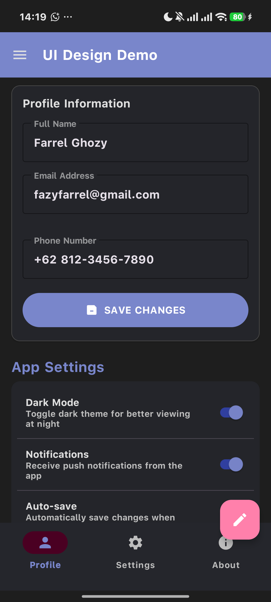
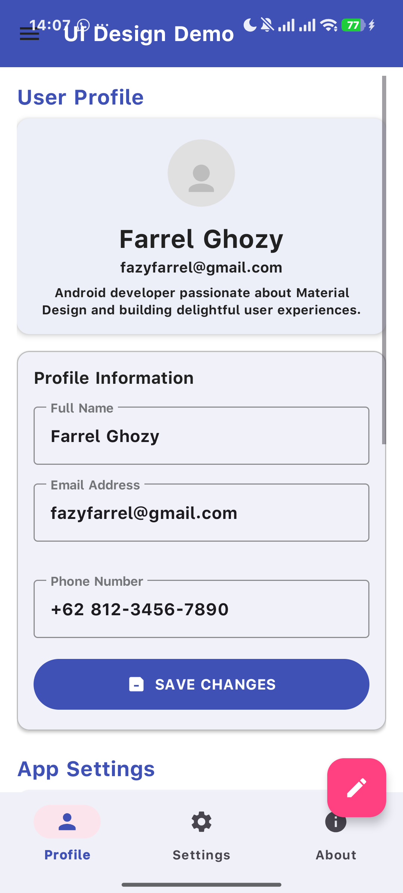
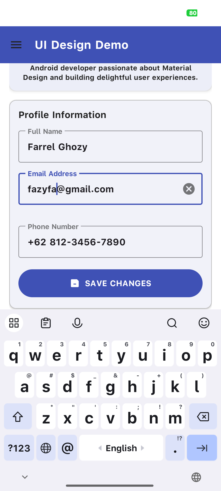
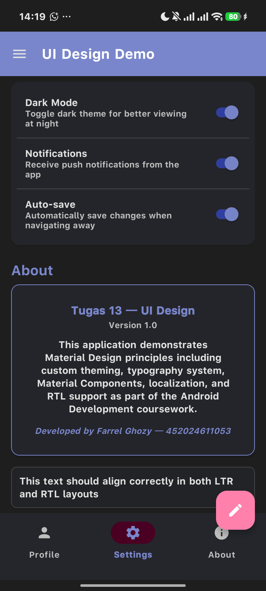
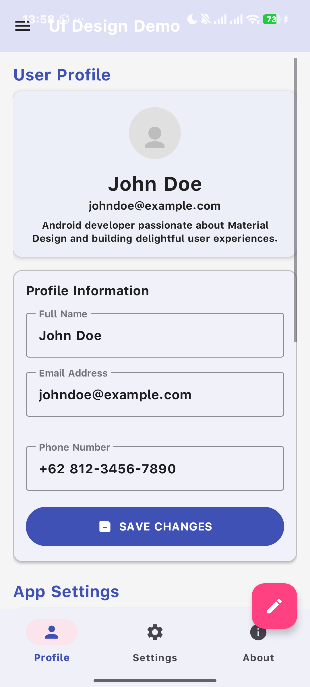
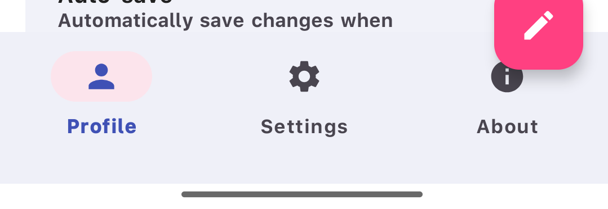
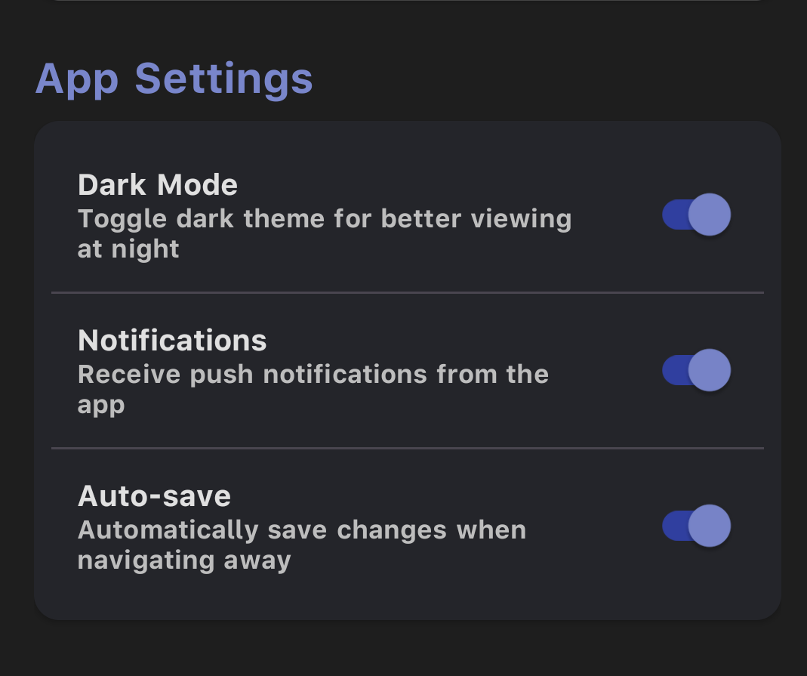
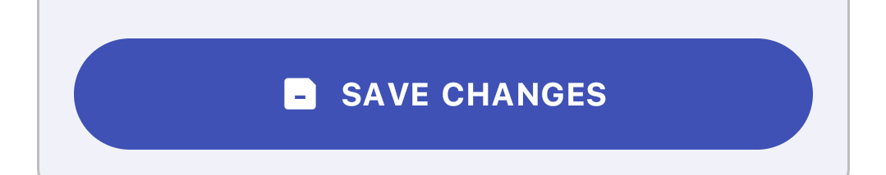
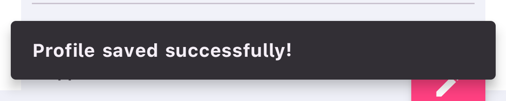

# Tugas 13 Android — App UI Design (Material Design)

## Identitas

| | |
|---|---|
| **Nama** | Farrel Ghozy |
| **NIM** | 452024611053 |
| **Mata Kuliah** | Pemrograman Perangkat Bergerak |
| **Topik** | Material Design, Styling, Dark Theme, Typography, Localization, RTL |

---

## 📱 Tentang Aplikasi

Aplikasi ini mendemonstrasikan implementasi **Material Design 3 (Material You)** pada platform Android menggunakan **Kotlin** dan **Material Components Library**. Fokus utama adalah konsistensi visual melalui sistem *theming*, *typography scale*, *localization*, serta dukungan **Dark Mode** dan **RTL (Right-to-Left)**.

### Fitur yang Diimplementasikan

| Fitur | Status | Detail |
|:------|:------|:-------|
| **Custom Theme** | ✅ | Palet warna kustom (primary, secondary, surface, error) di `themes.xml` |
| **Dark Mode** | ✅ | `values-night/themes.xml` — transisi otomatis berdasarkan sistem |
| **Typography Scale** | ✅ | 13 level Type Scale (Headline 1–6, Subtitle 1–2, Body 1–2, Button, Caption, Overline) — semua **sp** |
| **Material Components** | ✅ | TextInputLayout, MaterialCardView, FAB, BottomNavigationView, SwitchMaterial, MaterialButton, Snackbar |
| **Localization** | ✅ | `values/strings.xml` (EN) + `values-b+id/strings.xml` (Indonesia) |
| **RTL Support** | ✅ | Semua `left`/`right` diganti `start`/`end`; `supportsRtl="true"` di Manifest |
| **ViewBinding** | ✅ | Type-safe view binding |

---

## 📸 Bukti Visual

### Light Mode vs Dark Mode

| Light Mode | Dark Mode |
|:----------:|:---------:|
|  |  |

### Localization — Bahasa Indonesia

| English | Bahasa Indonesia |
|:-------:|:----------------:|
|  |  |

### Material Components

| Komponen | Screenshot |
|:---------|:----------:|
| **TextInputLayout** (OutlinedBox, error, clear_text) |  |
| **MaterialCardView** (elevated, stroked) |  |
| **FloatingActionButton** |  |
| **BottomNavigationView** (3 item, labeled) |  |
| **SwitchMaterial** (Dark Mode, Notifications, Auto-save) |  |
| **MaterialButton** (rounded, with icon) |  |
| **Snackbar** (dengan action UNDO) |  |

---

## 🧪 Cara Menjalankan

### Prasyarat
- Android Studio Hedgehog (2023.1.1) atau lebih baru
- JDK 17+
- Gradle 8.7
- Perangkat Android fisik (min API 26) atau emulator

### Langkah-langkah

1. **Clone repositori**
   ```bash
   git clone https://github.com/FarrelGhozy/Tugas13_Android_UI_Design_452024611053.git
   ```

2. **Buka di Android Studio**
   - File → Open → Pilih folder project
   - Tunggu Gradle Sync selesai

3. **Build & Run**
   - Hubungkan perangkat Android via USB (aktifkan USB Debugging)
   - Atau jalankan emulator
   - Klik tombol **Run** (▶) di Android Studio

4. **Verifikasi Dark Mode**
   - Buka **Settings → Display → Theme** di perangkat
   - Ganti ke Dark mode
   - Buka aplikasi — theme otomatis berubah

5. **Verifikasi Localization**
   - Buka **Settings → Language & Input → Languages**
   - Tambahkan **Bahasa Indonesia** sebagai bahasa utama
   - Buka aplikasi — semua teks berubah ke Bahasa Indonesia

---

## 🏗 Arsitektur Styling

### Hierarki & Tingkat Preseden (Precedence Rules)

Dalam Android Styling System, ada 3 level konfigurasi gaya visual yang bisa diterapkan pada sebuah View. Urutan prioritasnya dari yang **paling rendah** ke **paling tinggi** adalah:

```
                     ┌────────────────────────┐
                     │   🥇 VIEW ATTRIBUTES   │  ← Prioritas TERTINGGI
                     │  (android:textSize,    │     (Override theme & style)
                     │   android:textColor,   │
                     │   android:background)  │
                     └────────────────────────┘
                              ⬆⬆⬆
                     ┌────────────────────────┐
                     │   🥈 VIEW STYLE        │  ← Prioritas MENENGAH
                     │  (style="@style/...")  │     (Override theme)
                     │  Contoh:               │
                     │  style="@style/         │
                     │  TextAppearance.Tugas13 │
                     │  .Body1"               │
                     └────────────────────────┘
                              ⬆⬆⬆
                     ┌────────────────────────┐
                     │   🥉 THEME (Global)    │  ← Prioritas TERENDAH
                     │  (values/themes.xml,   │     (Default aplikasi)
                     │   AndroidManifest)     │
                     │  Contoh:               │
                     │  colorPrimary,         │
                     │  textAppearanceBody1   │
                     └────────────────────────┘
```

**Penjelasan:**

1. **Theme (🥉 — Prioritas Terendah):** Ditentukan di `res/values/themes.xml` dan diterapkan ke seluruh aplikasi melalui `AndroidManifest.xml`. Theme menyediakan nilai *default* global seperti `colorPrimary`, `colorSecondary`, `textAppearanceBody1`, dll. Theme juga mendukung kualifikasi folder seperti `values-night` untuk **Dark Mode**. Theme adalah *base layer* — jika tidak ada Style atau View Attribute yang menentukan properti tertentu, maka nilai dari Theme-lah yang digunakan.

2. **Style (🥈 — Prioritas Menengah):** Ditulis sebagai `style="@style/NamaStyle"` pada sebuah View di layout XML. Style mengelompokkan atribut-atribut visual (seperti `textSize`, `textColor`, `fontFamily`) menjadi satu kesatuan yang bisa dipakai ulang. Style *meng-override* Theme untuk View tertentu. Contoh: Sebuah TextView bisa punya style `TextAppearance.Tugas13.Body1` yang menentukan ukuran 14sp, meskipun theme global menetapkan ukuran lain untuk body text.

3. **View Attributes (🥇 — Prioritas Tertinggi):** Atribut yang ditulis langsung pada tag View di layout XML (misal: `android:textSize="18sp"`). Ini memiliki prioritas tertinggi dan akan *meng-override* apapun yang ditetapkan oleh Style maupun Theme. Namun, praktik ini sebaiknya dihindari karena membuat kode sulit dipelihara — lebih baik menggunakan Style untuk konsistensi.

**Contoh Kasus:**
```xml
<!-- Theme: colorPrimary = #3F51B5 (Biru) -->
<!-- Style: TextAppearance.Tugas13.Body1 → textSize = 14sp -->

<TextView
    android:textSize="18sp"          <!-- 🥇 VIEW ATTRIBUTE → override style & theme -->
    style="@style/TextAppearance.    <!-- 🥈 STYLE → override theme -->
        Tugas13.Body1"
    android:textColor="?attr/        <!-- 🥉 THEME → fallback jika tidak di-set -->
        colorPrimary" />
```

Hasilnya: teks akan berukuran **18sp** (View Attribute override), dengan gaya dasar dari `Body1`, dan warna dari Theme (`?attr/colorPrimary`). Ini menunjukkan bahwa **View Attributes > Style > Theme** dalam urutan prioritas.

---

## 🎨 Material Components yang Digunakan

Aplikasi ini mengintegrasikan **lebih dari 3 komponen Material Design** (syarat minimal terpenuhi):

| # | Komponen | Lokasi | Fungsi |
|:-:|:---------|:-------|:-------|
| 1 | **TextInputLayout** + **TextInputEditText** | `activity_main.xml` — Card Form | Input form dengan floating label, error, dan clear button |
| 2 | **MaterialCardView** (×4) | `activity_main.xml` | Kartu konten dengan elevation, rounded corners, dan stroke |
| 3 | **FloatingActionButton (FAB)** | `activity_main.xml` | Tombol aksi mengambang (edit profile) |
| 4 | **BottomNavigationView** | `activity_main.xml` | Navigasi 3 tab (Profile, Settings, About) |
| 5 | **SwitchMaterial** (×3) | Card Settings | Toggle untuk Dark Mode, Notifications, Auto-save |
| 6 | **MaterialButton** | Card Form | Tombol "Save Changes" dengan icon + rounded corner |
| 7 | **Snackbar** | `MainActivity.kt` (kode) | Feedback aksi dengan action UNDO |

---

## 🌐 Localization & RTL

### Multi-bahasa
- **English** — `res/values/strings.xml` (default)
- **Bahasa Indonesia** — `res/values-b+id/strings.xml`

Semua *user-facing strings* diekstrak ke `strings.xml` — **tidak ada hardcoded text** di layout XML atau kode Kotlin.

### RTL (Right-to-Left) Support
- `android:supportsRtl="true"` di `AndroidManifest.xml`
- Semua atribut `paddingLeft`/`paddingRight`/`marginLeft`/`marginRight` diganti dengan `paddingStart`/`paddingEnd`/`marginStart`/`marginEnd`
- Layout otomatis menyesuaikan untuk bahasa dengan arah kanan-ke-kiri (Arab, Urdu, dll.)

---

## 🔗 Link Repository

[https://github.com/FarrelGhozy/Tugas13_Android_UI_Design_452024611053](https://github.com/FarrelGhozy/Tugas13_Android_UI_Design_452024611053)

---

## 📚 Referensi

- [Google Developer Pathway — Lesson 13: App UI Design](https://developer.android.com/courses/pathways/android-development-with-kotlin-13?hl=id)
- [Material Design 3 Guidelines](https://m3.material.io/)
- [Material Components for Android](https://github.com/material-components/material-components-android)
- [Android Styling: Themes vs Styles](https://developer.android.com/guide/topics/ui/themes)
- [Android Dark Theme](https://developer.android.com/guide/topics/ui/darktheme)
- [Android Localization](https://developer.android.com/guide/topics/resources/localization)
- [Android RTL Support](https://developer.android.com/guide/topics/resources/layout-direction)
